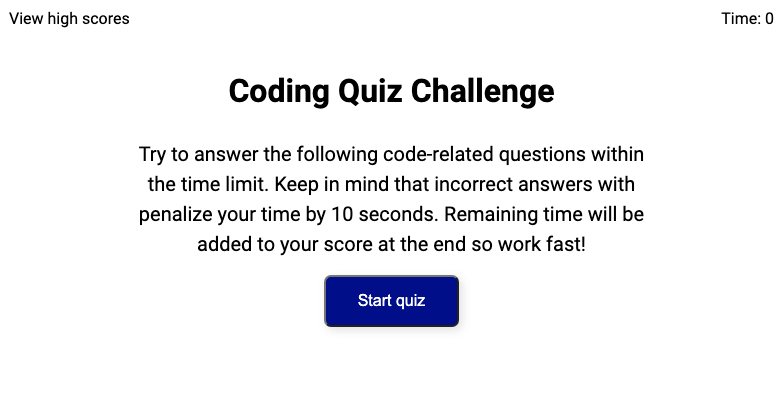
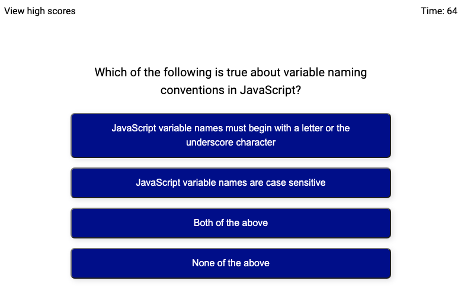
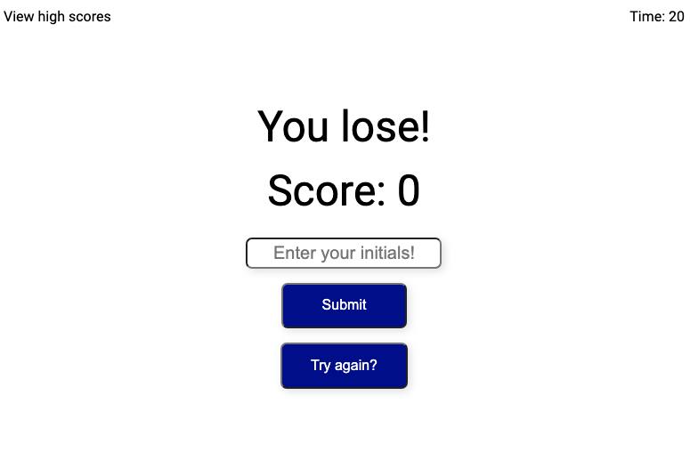
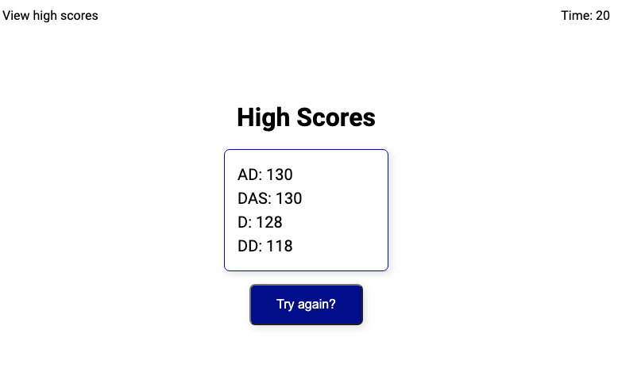

# Code Quiz

This project creates a multiple choice Javascript quiz that allows you to save your score and check the highest scores. The object was to create much of the HTML in Javascript dynamically without the aid of a framework.

## Technologies

- Javascript
- HTML
- CSS

## Screenshots

## Installation

To use this project, clone the repository to your computer using HTTPS or SSH.
